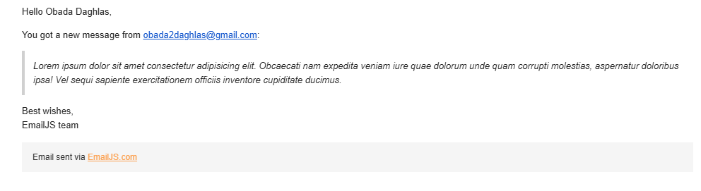

# Profile Page and 7-Segment Task.

A task requires to build a profile page which support the following skills and features:

1. DOM Manipulation.
2. Dark Theme.
3. Flexbox CSS layout.
4. Functional Contact form.
5. Simulation for fetching profile from a server. (JSON server were used).
6. User input for displaying specific 3 digit number on a 7 segment.
 - This Feature used Canvas for drawing 7-Segment displays and bit manipulation in order to decide which segment should be on and off.
7. Real-time Date and Time viewer in the footer of the Page.
8. Integration with EmailJS to make the functionality of Contact Me Section.

# How to run the project.

You need to install JSON server in order to fetch the data from the server.
```shell
npm install json-server
```

Now the json-server is installed you can run it using this command: 
```shell
npx json-server .\assets\dummy_data\users.json
```

# Contact Me Section

Sending an Email will send me the email, therefore you need to connect your own EmailJS key. Anyway here's a demo of how the email will be recived.

